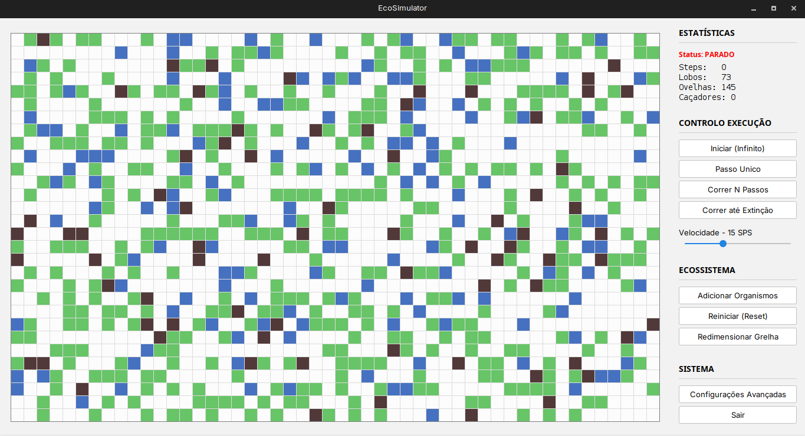

# EcoSimulator


A dynamic, 2D visual simulation of a predator-prey ecosystem. Watch how wolves, sheep, and plants interact in a grid-based environment, complete with real-time configuration, environmental events, and population statistics.



## How It Works

The simulation runs on a grid where different entities interact based on biological rules:

### The Organisms
| Icon | Entity | Behavior |
| :---: | :--- | :--- |
| **⬜** | **Empty** | Just open space. |
| **🌿** | **Plant** | Grows randomly on empty spots. Basis of the food chain. |
| **🐑** | **Sheep** | Eats plants to gain energy. Dies if energy reaches 0. Reproduces if energy is high. |
| **🐺** | **Wolf** | Predator. Hunts sheep for energy. Dies quickly without food. Harder to reproduce. |
| **🏹** | **Hunter** | **Special Event**: Appears when the animal population gets too high. |

---

## For Developers

### Prerequisites
* **Java JDK 21** (Required).
* **Maven** (For dependency management).

### How to Build & Run

1.  **Clone the repository:**
    ```bash
    git clone [https://github.com/AFaria20s/EcoSimulator.git](https://github.com/AFaria20s/EcoSimulator.git)
    cd EcoSimulator
    ```

2.  **Compile with Maven:**
    This will download the dependencies (FlatLaf) and build the executable.
    ```bash
    mvn clean package
    ```

3.  **Run the JAR:**
    *Note: We use the 'jar-with-dependencies' version to include the UI themes.*
    ```bash
    java -jar target/EcoSimulator-1.0-SNAPSHOT-jar-with-dependencies.jar
    ```

---

## ⚙Project Structure (MVC)
* `src/main/java/Model`: Ecosystem logic (`Wolf`, `Sheep`, `Organism`).
* `src/main/java/View`: Swing Interface (`SimulationPanel`, `ControlPanel`, `FlatLaf` themes).
* `src/main/java/Main.java`: Application entry point.

## License
This project is open-source.